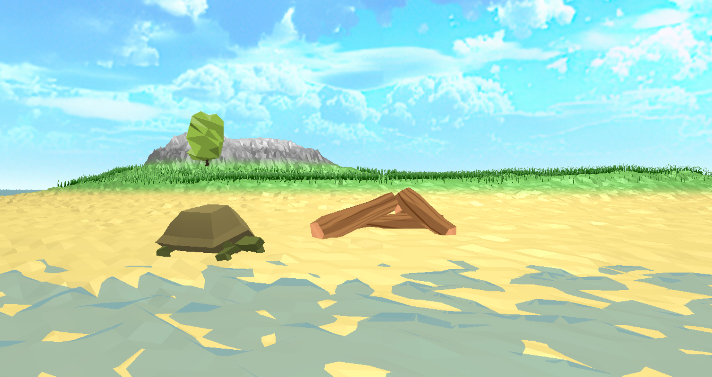
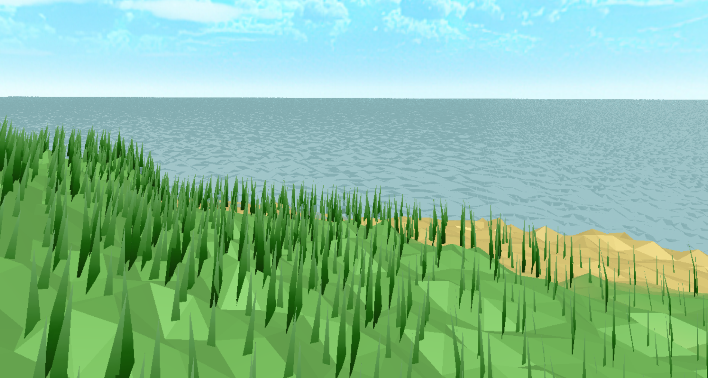
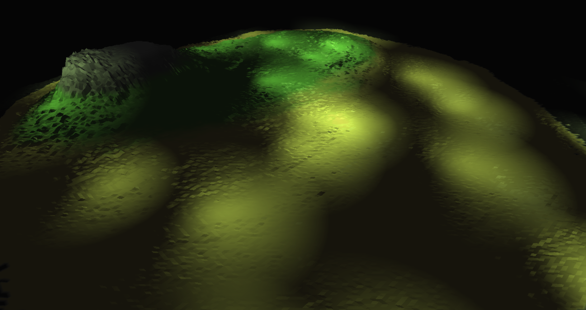
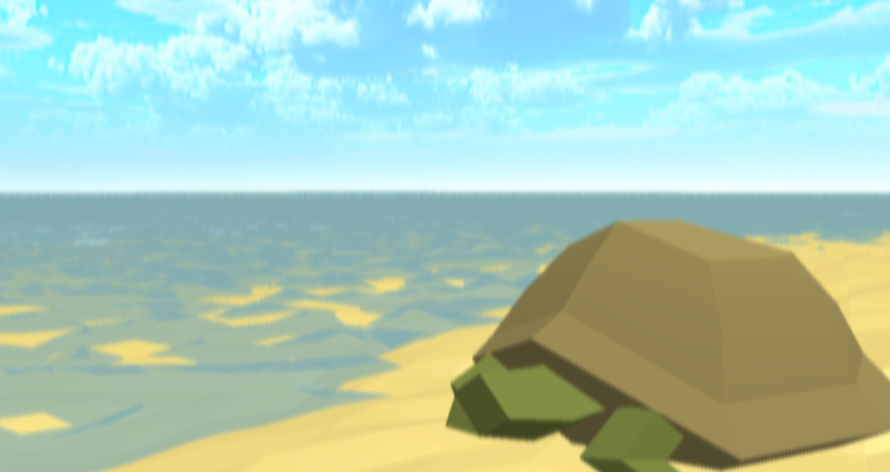
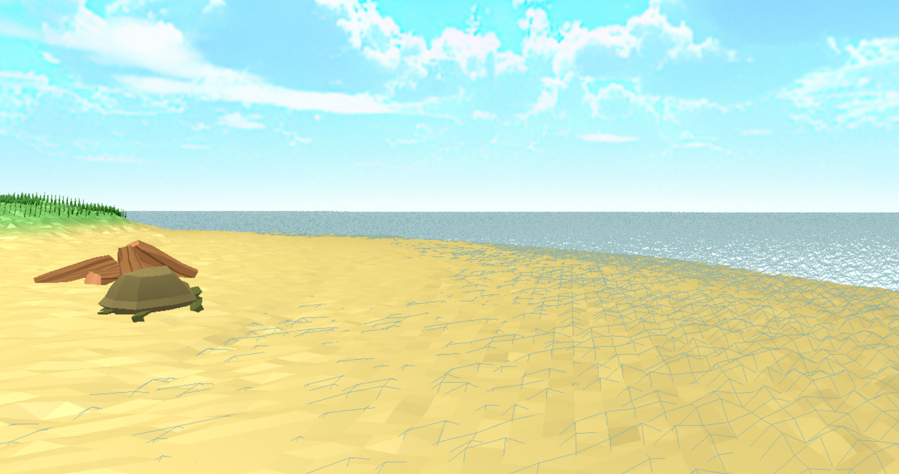

# OpenGL Island
>This is a 3D scene based on C++ and OpenGL, animation included  

### instruction 
- Press 1 to set multiple preset camera position  
- Press 2 to auto move the camera  
- Press 3 to auto rotate the camera  
- Press 7 to return to normal rendering  
- Press 8 to rendering with blur post-processing  
- Press 9 to rendering only island in deffered rendering pipeline with multiple lights  
- Press L to draw water wireframes  
- Press ESC to close window

### Low poly style scene 

### grass by geometry shader

### deferred pipeline (island only)

### blur post-processing

### water wireframe
